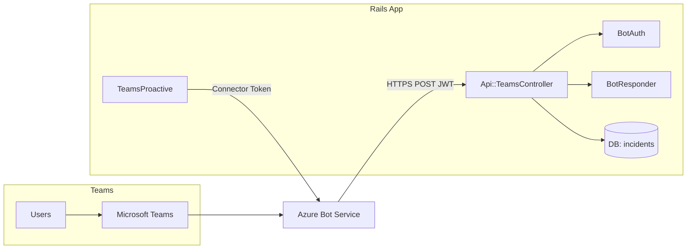
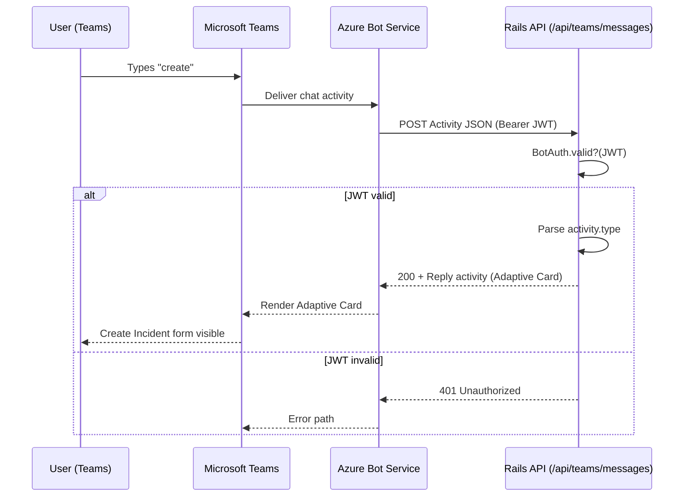
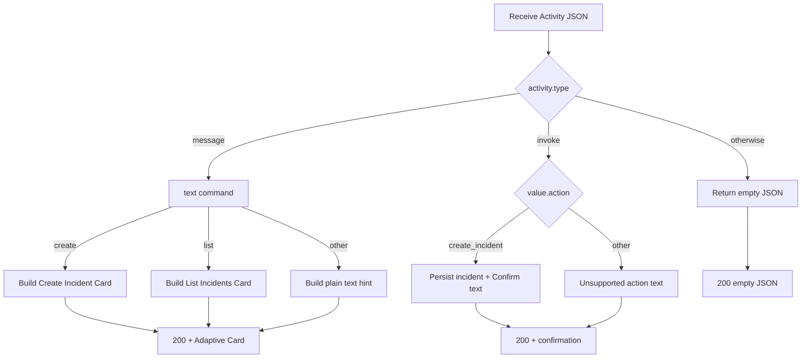
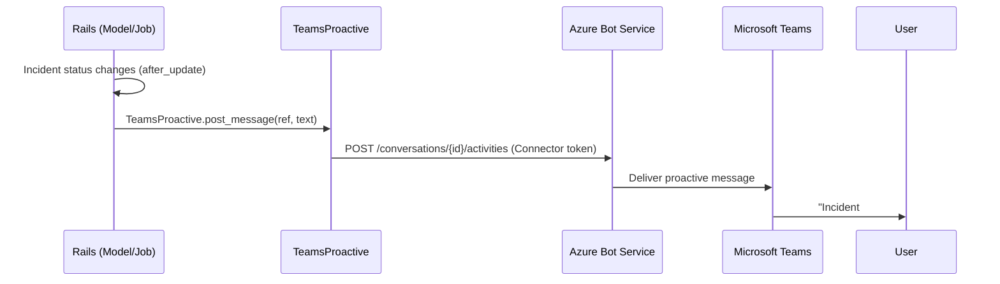

# Teams Bot Overview (Rails API)

This document explains how our Microsoft Teams bot integrates with Azure Bot Service and this Rails API to support incident tracking. It includes architecture, message flow, setup, local testing, and troubleshooting.

---

## Table of Contents

1. Architecture at a Glance  
2. End-to-End Message Flow  
3. Controller Logic  
4. Proactive Notifications  
5. Prerequisites  
6. Environment Variables  
7. Local Development  
8. HTTP Testing (curl)  
9. Rails Console Smoke Tests  
10. Security Notes  

---

## Architecture at a Glance



---

## End-to-End Message Flow



---

## Controller Logic



---

## Proactive Notifications



---

## Prerequisites

- Ruby 3.2+ / 3.3.x  
- Rails (API-only app recommended)  
- PostgreSQL (or preferred DB)  
- ngrok (for local HTTPS tunneling)  
- Azure Bot registration (App ID/Password) and Teams app manifest  

---

## Environment Variables

```
MICROSOFT_APP_ID=00000000-0000-0000-0000-000000000000
MICROSOFT_APP_PASSWORD=super-secret
BOT_OPENID_CONFIG=https://login.botframework.com/v1/.well-known/openidconfiguration
RACK_TIMEOUT_SERVICE_TIMEOUT=12
RAILS_LOG_TO_STDOUT=true
```

---

## Local Development

```bash
bundle install
bin/rails s
ngrok http 3000
curl http://localhost:3000/api/health
```

---

## HTTP Testing (curl)

```bash
# Simulate "create" message
curl -X POST http://localhost:3000/api/teams/messages \
  -H "Content-Type: application/json" \
  -H "Authorization: Bearer FAKE" \
  -d '{"type":"message","id":"abc123","serviceUrl":"https://smba.trafficmanager.net/uk/","channelId":"msteams","from":{"id":"user-id"},"recipient":{"id":"bot-id"},"conversation":{"id":"conv-id"},"text":"create"}'

# Simulate invoke submit
curl -X POST http://localhost:3000/api/teams/messages \
  -H "Content-Type: application/json" \
  -H "Authorization: Bearer FAKE" \
  -d '{"type":"invoke","id":"abc124","serviceUrl":"https://smba.trafficmanager.net/uk/","channelId":"msteams","from":{"id":"user-id"},"recipient":{"id":"bot-id"},"conversation":{"id":"conv-id"},"value":{"action":"create_incident","title":"Database outage"}}'
```

---

## Rails Console Smoke Tests

```ruby
# 1. Fake activity
activity = {
  "type" => "message",
  "id" => "abc123",
  "serviceUrl" => "https://smba.trafficmanager.net/uk/",
  "channelId" => "msteams",
  "from" => { "id" => "user-id" },
  "recipient" => { "id" => "bot-id" },
  "conversation" => { "id" => "conv-id" },
  "text" => "create"
}

# 2. Build Create Incident card
BotResponder.card_reply(activity, Api::TeamsController.new.send(:create_incident_card))

# 3. Build List Incidents card
BotResponder.card_reply(activity, Api::TeamsController.new.send(:list_incidents_card))

# 4. Simulate invoke submit
invoke_activity = activity.merge(
  "type" => "invoke",
  "value" => { "action" => "create_incident", "title" => "Database outage" }
)
Api::TeamsController.new.send(:handle_invoke, invoke_activity)

# 5. Auth helper
BotAuth.valid?(authorization: "Bearer not-a-real-token", app_id: ENV["MICROSOFT_APP_ID"])
# => false
```

---

## Security Notes

- JWT validation is mandatory outside dev  
- Rate limiting via Rack::Attack  
- Short request timeouts (10–12s)  


